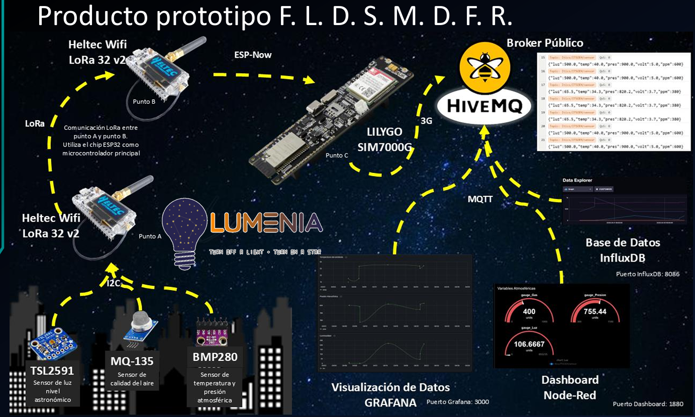

# MANUAL DE USUARIO Y REFERENCIA TÉCNICA INTEGRAL

## Plataforma Distribuida de Monitoreo Ambiental y Contaminación Lumínica "Lumenia"

### DATOS INSTITUCIONALES DEL PROYECTO

* **Prototipo Desarrollado:** FLDSMDFR (Full Light Detection & Skyglow Monitoring: Dark-sky Field Research)
* **Autores e Integrantes del Equipo:**
* Calva Abraham (Matrícula: 230110637)
* Gonzaga López Luis Fernando (Matrícula: 230110528)
* López Paz Gustavo (Matrícula: 230110531)
* Martínez Hernández Brayan (Matrícula: 230110578)

* **Programa Académico:** Ingeniería en Tecnologías de la Información y Comunicaciones
* **Asignatura y Nivel:** Proyecto Integrador – 6° Semestre, Grupo B
* **Institución Educativa:** Instituto Tecnológico Superior del Occidente del Estado de Hidalgo (ITSOEH)
* **Catedrático Evaluador:** Mtro. Saúl Isaí Soto Ortiz
* **Periodo de Desarrollo:** Enero – Mayo 2026
* **Ubicación de Emisión:** Mixquiahuala de Juárez, Hidalgo, México

---

## 1. INTRODUCCIÓN Y JUSTIFICACIÓN DEL PROYECTO

La transición acelerada hacia entornos urbanos hiper-iluminados ha transformado la noche de un fenómeno natural en un producto de la ingeniería civil. Si bien la iluminación artificial nocturna (ALAN, por sus siglas en inglés) es un pilar fundamental para la seguridad pública y el desarrollo económico, su gestión deficiente y descontrolada ha dado origen a la contaminación lumínica. La International Dark-Sky Association (IDA) la define formalmente como el uso inapropiado, intrusivo o excesivo de luz artificial, cuyas consecuencias directas impactan críticamente en la biodiversidad, la investigación científica astronómica, la salud visual y la estabilidad de los ecosistemas nocturnos.

### El Fenómeno del Skyglow y la Pérdida del Patrimonio Astronómico

Uno de los efectos más visibles y alarmantes de la sobreiluminación es el skyglow o resplandor lumínico nocturno. Este fenómeno se manifiesta como un domo difuso de luz grisácea o amarillenta que cubre las ciudades. De acuerdo con los datos técnicos expuestos en el "New World Atlas of Artificial Night Sky Brightness", más del 80% de la población mundial vive bajo cielos contaminados por luz, lo que impide de forma directa que un tercio de la humanidad pueda observar la Vía Láctea desde sus lugares de origen. La Unión Astronómica Internacional (IAU) ha advertido que la dispersión de luz artificial en las partículas flotantes de la atmósfera erosiona un patrimonio cultural y natural fundamental para la ciencia. El proyecto FLDSMDFR aborda esta problemática de manera empírica, relacionando la iluminancia con la calidad del aire.

### Impacto en la Salud Pública y la Alteración del Ciclo Circadiano

La problemática de la contaminación lumínica trasciende la pérdida del cielo estrellado y se convierte en un tema crítico de salud pública. La Organización Mundial de la Salud (OMS) y diversas investigaciones en el área de la cronobiología señalan que la exposición a luz blanca e intensa durante las horas de la noche inhibe drásticamente la producción de melatonina en el cerebro, alterando el ciclo circadiano. Esta disrupción crónica se asocia con trastornos severos del sueño, fatiga e incremento de riesgos metabólicos. Asimismo, la Comisión Internacional de la Iluminación (CIE) destaca que el deslumbramiento y el exceso de contraste en vialidades públicas afectan negativamente el confort visual, incrementando la fatiga ocular y reduciendo la capacidad de reacción, lo que contradice el propósito original de seguridad de la iluminación pública.

### Contexto Nacional y Marco Estratégico

En México, el crecimiento demográfico acelerado y la expansión urbana mal planificada han superado la capacidad de aplicar políticas de iluminación sostenible. El prototipo FLDSMDFR se alinea directamente con los Programas Nacionales Estratégicos (PRONACES) del CONAHCYT, específicamente dentro de los ejes prioritarios de Sustentabilidad Ambiental y Agentes Tóxicos y Procesos Contaminantes. Al proponer una infraestructura de monitoreo basada en el Internet de las Cosas (IoT) y la tecnología inalámbrica de largo alcance LoRa, este proyecto busca cubrir la carencia actual de datos técnicos precisos y de bajo costo en los municipios del Valle del Mezquital, permitiendo evaluar el cumplimiento de normativas vigentes como la NOM-013-ENER-2013 (Eficiencia energética para alumbrado en vialidades). El ecosistema convierte la percepción subjetiva de la sobreiluminación en datos cuantitativos y reproducibles.

---

## 2. OBJETIVOS DEL SISTEMA

### 2.1 Objetivo General

Diseñar e implementar un sistema IoT distribuido para el monitoreo y análisis de la contaminación lumínica, mediante el uso de sensores de alta sensibilidad y tecnología de transmisión inalámbrica LoRa, con el fin de cuantificar el brillo del cielo nocturno (skyglow) y la eficiencia de la iluminación pública, generando datos en tiempo real visualizados en plataformas de gestión (Grafana/Node-RED) que fundamenten estrategias de sostenibilidad ambiental y preservación de la visibilidad astronómica en entornos urbanos e institucionales.

### 2.2 Objetivos Específicos

* **Configurar y ensamblar** nodos sensores basados en microcontroladores de alta eficiencia, integrando el sensor TSL2591 para la captura de luminancia en rangos de baja intensidad, el BMP280 para el monitoreo de variables atmosféricas y el MQ-135 para identificar agentes contaminantes o nubosidad que actúan como elementos de dispersión de luz.
* **Implementar un protocolo de comunicación inalámbrica** basado en tecnología LoRa que garantice la transmisión de datos en formato JSON desde los nodos periféricos hasta un Gateway central, asegurando la robustez y el alcance de la señal en entornos institucionales o urbanos.
* **Orquestar un ecosistema de datos** mediante Docker que integre Node-RED para la gestión del flujo de información e InfluxDB como motor de persistencia para el almacenamiento de series temporales de todas las variables recolectadas.
* **Diseñar tableros interactivos en Grafana** que permitan analizar en tiempo real la relación entre la calidad del aire y los niveles de sobreexposición lumínica, facilitando la interpretación técnica del fenómeno del skyglow bajo distintas condiciones atmosféricas.
* **Evaluar el desempeño operativo** del sistema FLDSMDFR en campo para generar información cuantificable que permita sustentar estrategias de gestión lumínica y promover la preservación de la visibilidad astronómica y salud visual.

---

## 3. DESCRIPCIÓN DETALLADA DE LA INSTRUMENTACIÓN (SENSORES)

En esta etapa del proyecto, la instrumentación ha sido seleccionada meticulosamente para garantizar precisión en entornos de muy baja señal, permitiendo una caracterización multimodal del entorno nocturno.

### Tabla 1: Justificación e Impacto de los Componentes

| Sensor / Componente | Variables Medidas | Justificación e Impacto Técnico en el Sistema |
| --- | --- | --- |
| **TSL2591 HDR**  (Evolución del GY-30) | Iluminancia en luxes (lx) e infrarrojo cercano. | Sensor óptico de rango dinámico extremo. A diferencia del BH1750 (GY-30) que cuenta con un límite inferior de 1 lux de resolución, el TSL2591 posee una sensibilidad de hasta 188 microluxes (µlux). Permite registrar las variaciones mínimas del cielo nocturno (skyglow) traduciendo percepciones subjetivas en métricas de alta precisión para el éxito del monitoreo. |
| **BMP280** | Temperatura (°C) y Presión Atmosférica (hPa). | Aporta el contexto físico de la densidad y estabilidad de la atmósfera. Los frentes climáticos y cambios de presión modifican el índice de refracción, alterando directamente cómo se refracta y dispersa la luz artificial hacia el cenit. |
| **MQ-135** | CO2, amoníaco, benceno, humo y gases. | Identifica la carga de agentes contaminantes en PPM. Esencial debido a que los aerosoles y partículas suspendidas actúan como elementos de dispersión bajo el efecto Mie, atrapando la luz ascendente y magnificando el "domo de luz" urbano. |

### Módulos de Expansión Tecnológica Futura

Bajo un enfoque de arquitectura modular y escalable, el sistema contempla la futura validación e integración de las siguientes variables:

* **Sensor de Luz Ultravioleta (VEML6075):** Mide índices de luz UV-A y UV-B para validar la ausencia absoluta de radiación solar residual en las mediciones nocturnas, aportando un enfoque de salud dermatológica preventiva frente al estrés oxidativo urbano.
* **Sensor de Luz Espectral (AS7341 o TCS34725):** Diseñado para determinar la firma cromática (RGB y temperatura de color) de las luminarias públicas, diferenciando la iluminación cálida de la fría (luz azul), la cual tiene un mayor índice de dispersión Rayleigh/Mie e impacto directo en los ritmos circadianos .

* **Sensor de Nivel de Ruido (KY-037):** Encargado de capturar el nivel sonoro ambiental para evaluar el confort y bienestar nocturno urbano desde una perspectiva multidimensional .

---

## 4. ESQUEMAS DE CONEXIÓN ELÉCTRICA (PINOUTS)

El hardware pasó de una fase de pruebas en protoboard a una placa de prototipos perforada permanente con conexiones debidamente soldadas, eliminando falsos contactos durante el monitoreo continuo en campo.

*Figura 1. circuito general del sistema LUMENIA.*

### Tabla 2: Conexiones del Nodo Emisor Periférico

Todos los sensores del nodo periférico interactúan mediante el bus físico I2C, compartiendo líneas y estabilizados por el pin controlado por software `Vext` .

| Sensor / Periférico | Pin del Sensor | Pin Heltec LoRa 32 V2 | Descripción y Notas de Estabilidad |
| --- | --- | --- | --- |
| **TSL2591 / GY-30** | VCC  GND  SDA  SCL | 3.3V (Línea Vext)  GND  GPIO 4  GPIO 15 | Alimentación conmutada (GPIO 21 = LOW activa energía).  Tierra común obligatoria de referencia.  Línea de datos I2C con Pull-up interno habilitado.  Línea de reloj I2C con Pull-up interno habilitado. |
| **BMP280** | VCC  GND  SDA  SCL | 3.3V (Línea Vext)  GND  GPIO 4  GPIO 15 | Comparte la línea conmutada de energía de sensores.  Tierra común de la placa.  Comparte canal de datos I2C (Dirección lógica 0x76).  Comparte canal de reloj de bus I2C. |
| **MQ-135** | VCC  GND  AOUT  DOUT | 5V (Línea USB)  GND  GPIO 36  GPIO 37 | Requiere voltaje estable de 5V para su celda de calentamiento térmica.  Tierra común de referencia.  Entrada analógica nativa de 12 bits (ADC1_CH0).  Salida digital de umbral por hardware (Opcional). |

### Tabla 3: Conexiones en el Bloque de Recepción (Bridge Gateway)

La Heltec receptora se acopla directamente por hardware a la pasarela celular Lilygo a través de sus puertos UART seriales dedicados .

| Tarjeta Origen (Heltec RX) | Pin de Salida | Tarjeta Destino (Lilygo Gateway) | Pin de Entrada | Descripción de la Interfaz Serial |
| --- | --- | --- | --- | --- |
| **Heltec WiFi LoRa 32 V2** | GPIO 23 (TXD) | **Lilygo SIM7080G-S3** | Pin 08 (RXD) | Traspaso en ráfaga serie de la cadena CSV parseada. |
| **Heltec WiFi LoRa 32 V2** | GPIO 22 (RXD) | **Lilygo SIM7080G-S3** | Pin 03 (TXD) | Canal inverso de control y comandos serie externos. |
| **Heltec WiFi LoRa 32 V2** | GND | **Lilygo SIM7080G-S3** | GND común | Referencia de nivel cero común (Obligatoria). |

---

## 5. MATRICES DE DIRECCIONAMIENTO Y PARÁMETROS DE RED

### Direccionamiento I2C e Interfaces de Entrada

* **Módulo Óptico TSL2591:** Dirección lógica fija `0x29` de fábrica.
* **Módulo Barométrico BMP280:** Dirección lógica `0x76` por defecto (configurable a `0x77` al puentear el pin SDO).
* **Módulo Óptico GY-30 (Legacy):** Dirección lógica `0x23` (pin ADDR a nivel bajo).
* **Módulo de Gas MQ-135:** Interfaz analógica conectada al GPIO 36 mapeado en el ADC1 interno.

### Perfil de Configuración de Radiofrecuencia (LoRa P2P)

| Parámetro de Radio | Valor Asignado | Justificación Operativa / Regulatoria |
| --- | --- | --- |
| **Frecuencia Central** | 915 MHz (`915E6`) | Esquina operativa de la banda ISM libre autorizada en México por el IFT. |
| **SyncWord (Palabra Sinc)** | `0x12` | Filtro lógico por software para evitar interferencias de redes ajenas. |
| **Spreading Factor (SF)** | 7 | Configuración óptima balanceada entre velocidad de ráfaga y alcance. |
| **Ancho de Banda (BW)** | 125 kHz | Ancho de canal estándar internacional para modulación Chirp Spread Spectrum. |
| **Intervalo de Envío** | 2000 ms (2s) | Tiempo suficiente para registrar cambios ambientales sin saturar el espectro. |

---

## 6. ARQUITECTURA DEL SISTEMA Y PROTOCOLOS DE COMUNICACIÓN

El prototipo FLDSMDFR implementa una pila de protocolos multi-capa orientada a garantizar resiliencia en entornos institucionales y urbanos:

1. **Protocolo I2C (Inter-Integrated Circuit):** Utilizado para la comunicación síncrona entre el microcontrolador ESP32 y los sensores periféricos mediante las líneas de datos (SDA) y reloj (SCL) compartidas, optimizando el uso de pines lógicos .

2. **Protocolo SPI (Serial Peripheral Interface):** Canal síncrono de alta velocidad utilizado internamente para la transferencia de datos entre el núcleo del ESP32 y el transceptor de radio LoRa integrado (chip SX1276/78).
3. **Protocolo LoRa (Capa Física LPWAN):** Modulación por espectro ensanchado (Chirp Spread Spectrum) encargada del envío inalámbrico de tramas de telemetría a largas distancias con consumo de energía optimizado .

4. **Formato JSON (Capa de Aplicación):** Estructura estándar de organización de datos basada en pares clave-valor que unifica las variables de telemetría antes de su inyección a la nube .

### Implementación de una Red Alámbrica de Emergencia

Complementando la infraestructura de largo alcance, el prototipo integra un principio de **tolerancia a fallos** mediante una red de respaldo confinada por medio físico. Basada en los estándares de **Ethernet IEEE 802.3**, establece conectividad redundante directa y dedicada entre nodos utilizando un switch de Capa 2. Ante una eventual degradación del medio guiado por inducción, saturación del espectro radioeléctrico o falla en las antenas, el sistema realiza una transición inmediata hacia la infraestructura cableada, manteniendo la persistencia de las sesiones y servicios sin requerir reconfiguraciones lógicas en el endpoint.

*Figura 1. Arquitectura general del sistema LUMENIA.*

---

## 7. GESTIÓN DE FLUJO DE DATOS EN TIEMPO REAL E INTEROPERABILIDAD

### Centralización y Desacoplamiento de Datos

Debido a que los nodos sensores operan de forma distribuida en un estado inalámbrico, la utilización de un broker MQTT permite centralizar la información evitando la necesidad de conocer direcciones IP o estados internos de los receptores. Esto dota al sistema de flexibilidad absoluta para añadir múltiples tableros visuales o bases de datos sin reprogramar los dispositivos físicos de campo.

### Organización Mediante "Topics" y Jerarquías

La información se organiza de forma escalable a través de jerarquías estructuradas que demuestran segmentación por tipo de de institución y tipo de dato (ej. `Itics/ITSOEH/sensor`). Esto facilita el crecimiento de la red de monitoreo urbano y permite que las herramientas de gestión filtren la información sin provocar colisiones de datos en el backend.

### Calidad de Servicio (QoS) y Control de Fallos

El broker distribuye los payloads bajo políticas adaptables de Calidad de Servicio:

* **QoS 0 (Fire-and-forget):** Utilizado para las variables de telemetría regular y flujos de datos continuos, donde la pérdida ocasional de una trama no altera las tendencias estadísticas del análisis a largo plazo.
* **QoS 1 o QoS 2:** Reservado para eventos críticos o alarmas del sistema, tales como picos drásticos de gases contaminantes o caídas del voltaje de operación por debajo de los umbrales nominales, garantizando la entrega del mensaje frente a intermitencias de la red celular.

---

## 8. GESTIÓN ENERGÉTICA, VALIDACIÓN DE RESULTADOS Y CONCLUSIONES

### Proyección de Autonomía de Baterías LiPo

El nodo periférico incorpora soporte para celdas LiPo de 3.7V acopladas por interfaz JST. Bajo ráfagas de transmisión activa de radiofrecuencia el consumo se sitúa en 180 mA. Al implementar ciclos de bajo consumo mediante suspensión profunda (`esp_deep_sleep_start()`) durante el 95% del ciclo operativo, la autonomía estimada es la siguiente :

* **Batería de 1000 mAh:** ~5.5 horas de forma activa continua / **~4.5 días** en campo.
* **Batería de 2000 mAh:** ~11.0 horas de forma activa continua / **~9.0 días** en campo.
* **Batería de 3000 mAh:** ~16.5 horas de forma activa continua / **~13.5 días** en campo.

### Validación Funcional y Resultados de Campo

Durante la fase de experimentación del prototipo, se realizaron múltiples ciclos de lectura y validación incremental:

* **Módulo de Adquisición:** En condiciones de iluminación interior controlada, el sensor óptico registró valores estables entre 35 y 120 lux, mientras que en exposición directa superó los 300 lux, demostrando sensibilidad adecuada para el estudio de sobreexposición. El BMP280 arrojó lecturas consistentes dentro de un rango de tolerancia de ±1 °C respecto a estaciones meteorológicas de referencia local.
* **Módulo de Transmisión LoRa:** El envío de datos en la banda de 915 MHz fue totalmente exitoso bajo el perfil Sync Word 0x12, confirmando recepción íntegra de tramas CSV cada 2 segundos sin pérdidas de paquetes registradas en el entorno local .

* **Módulo Analítico JSON y Dashboards:** El gateway segmentó las variables de forma correcta mediante delimitadores lógicos y construyó los objetos JSON analizados por Node-RED e InfluxDB con consultas Flux ejecutadas con una latencia mínima de 0.01 segundos.

### Conclusiones Individuales del Equipo

* **Calva Abraham:** El desarrollo del prototipo permitió integrar de manera funcional los módulos de adquisición, transmisión y visualización de datos ambientales nocturnos, validando la viabilidad técnica del sistema propuesto. La correcta lectura de los sensores junto con la transmisión estable mediante LoRa y la visualización web vía WiFi, demuestra que la arquitectura IoT implementada es coherente y escalable. Los resultados estadísticos obtenidos respaldan la estabilidad de las mediciones y evidencian la utilidad del sistema para analizar niveles de iluminación en distintos escenarios, constituyendo una base sólida para futuras ampliaciones y estudios más profundos sobre contaminación lumínica .

* **Martínez Hernández Brayan:** La implementación del prototipo confirmó que es posible desarrollar una solución de monitoreo ambiental basada en tecnologías de bajo consumo energético y comunicación inalámbrica de largo alcance. La integración entre el nodo transmisor y el gateway permitió validar la interoperabilidad entre LoRa y redes IP, consolidando una arquitectura eficiente y adaptable. El análisis de datos recopilados demuestra que el sistema puede registrar variaciones reales en iluminancia y condiciones ambientales, aportando información objetiva para el estudio del confort visual y la sobreexposición nocturna. En conjunto, el proyecto evidencia un equilibrio adecuado entre factibilidad técnica, escalabilidad y pertinencia social .

* **Gonzaga López Luis Fernando:** A lo largo del desarrollo se aplicaron procedimientos de configuración y validación que permitieron comprender la importancia de las comunicaciones inalámbricas en sistemas IoT distribuidos. La selección de LoRa como medio principal respondió a criterios de alcance y eficiencia energética, mientras que WiFi facilitó la visualización remota mediante un dashboard funcional. Los resultados obtenidos muestran consistencia en la adquisición y transmisión de datos, confirmando la correcta integración hardware-software. Este prototipo representa una herramienta inicial para cuantificar condiciones de iluminación nocturna y constituye un paso preliminar hacia la generación de evidencia técnica para la toma de decisiones en entornos urbanos .

* **López Paz Gustavo:** El proyecto demostró que la combinación de sensores ambientales, microcontroladores y tecnologías inalámbricas permite construir un sistema de monitoreo confiable y modular. Las pruebas realizadas evidenciaron estabilidad en las mediciones, integridad en la transmisión de datos y correcta estructuración en formato JSON para su visualización en tiempo real. La arquitectura implementada no solo cumple con los objetivos técnicos planteados, sino que también abre la posibilidad de escalar el sistema hacia redes más amplias de monitoreo. En este sentido, el prototipo establece una base tecnológica sólida para abordar la problemática de la iluminación nocturna desde una perspectiva cuantitativa y sistemática.

---

## 📚 REFERENCIAS BIBLIOGRÁFICAS

1. International Dark-Sky Association. *Light Pollution and Its Impacts* (2023). [https://www.darksky.org/light-pollution/](https://www.darksky.org/light-pollution/).
2. Augustin, A., Yi, J., Clausen, T. & Townsley, W. *A Study of LoRa: Long Range Low Power Networks for the Internet of Things*. Sensors 16, 1466 (2016).
3. Cho, Y., Ryu, S. & Lee, B. H. *Effects of Artificial Light at Night on Human Health: A Literature Review*. Chronobiology International 35, 1729-1744 (2018).
4. SEMARNAT. *Contaminación lumínica y su impacto ambiental en México* (2022). [https://www.gob.mx/semarnat](https://www.gob.mx/semarnat).
5. Falchi, F., Cinzano, P., Duriscoe, D. & Kyba, C. C. M. *The New World Atlas of Artificial Night Sky Brightness* 1st Ed. (Springer International Publishing, 2016).
6. *NOM-013-ENER-2013 — Eficiencia energética para alumbrado en vialidades*. Diario Oficial de la Federación, México (2013).